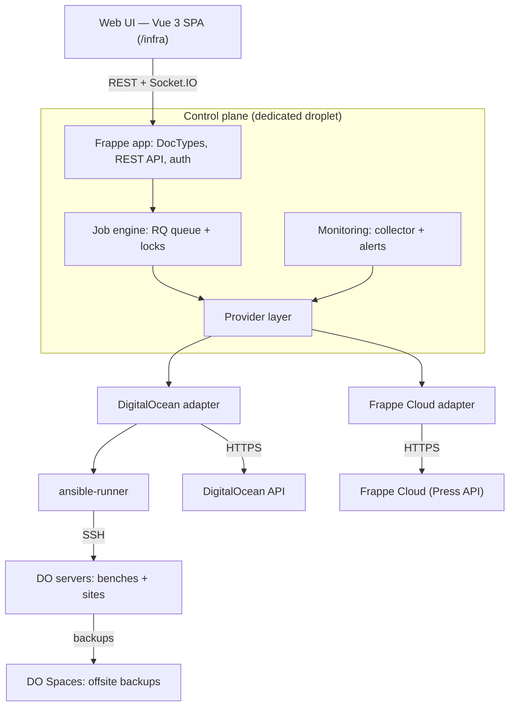

# Infrastructure Orchestrator — Technical Implementation Plan

> **Audience:** two AI coding agents working in parallel, plus one human reviewer (Ameen).
> **Status:** v1.0 — 2026-10-07
> **Working name:** `infra_control` (rename allowed before Phase 0 ends, never after).

---

## 0. How to use this document

1. Read sections 1–6 fully before writing any code.
2. Find your agent in section 7. You only edit paths you own.
3. Work phase by phase (section 12). Do not start a phase until the previous phase's **exit gate** passes.
4. If anything here is ambiguous or blocks you, **stop and write the question in `docs/QUESTIONS.md`**. Do not guess on anything listed under "Fixed decisions".

---

## 1. Goal

One control system that manages all SmartChoice IQ hosting from a single UI:

- Servers, benches and sites on **DigitalOcean** (self-managed, IaaS).
- Sites and benches on **Frappe Cloud** (managed, PaaS).
- Every change goes through an audited, retryable job. No manual SSH for routine work.
- A visually outstanding, dark-first "mission control" UI with purposeful motion.

### In scope (v1)

| Area | Capability |
|---|---|
| Provisioning | New DO droplet to ready bench in one action |
| Site ops | Create, migrate, backup, restore, domain + SSL, maintenance mode, suspend |
| Bulk ops | Canary first, then batches, halt on first failure |
| Services | Restart/reload nginx, supervisor, MariaDB, Redis (DO only) |
| Monitoring | Heartbeat, CPU, RAM, disk, load, queue backlog, SSL expiry |
| Alerts | Rules, firing/resolved states, Telegram + email |
| Backups | Scheduled offsite to DO Spaces, monthly restore test |
| Multi-provider | DigitalOcean + Frappe Cloud behind one interface |
| Audit | Immutable log of who did what, when, result |

### Out of scope (v2+)

Billing and subscriptions, auto-scaling, other cloud providers, a custom per-server agent, light theme.

---

## 2. Fixed decisions

Do not change these without human approval.

| Layer | Decision |
|---|---|
| Control plane | Frappe v15 app `infra_control` on a **dedicated** droplet. Hosts no client sites. |
| Executor (DO) | Ansible via `ansible-runner`, launched from an RQ worker |
| Executor (Frappe Cloud) | HTTPS calls to the Press API through one client class |
| Queue | Dedicated RQ queue `infra`; one running job per target server (Redis lock) |
| Realtime | Frappe Socket.IO (`frappe.publish_realtime`) |
| Frontend | Vue 3 + Vite + TypeScript + Pinia, SPA served at `/infra` |
| Styling | Tailwind CSS + design tokens as CSS variables |
| Motion | `motion` (motion.dev) for UI; GSAP only for topology and overview hero scenes |
| Topology | Vue Flow |
| Charts | Apache ECharts |
| Live logs | xterm.js |
| Metrics store | MariaDB table with rollups (1m → 1h → 1d) |
| Secrets | Frappe `Password` fields + Ansible Vault. Never in repo, logs or job output |
| Python | 3.11+, `ruff` + `mypy --strict` on `infra_control/` |
| JS | Node 20+, `eslint` + `vue-tsc` |
| Tests | `pytest` (backend), `vitest` + Playwright (frontend), Molecule (Ansible) |

---

## 3. Architecture



**Core rule:** nothing mutates infrastructure except an `Infra Job` executed by the job engine through a provider adapter. The UI and the monitoring module never call DO, Press or SSH directly.

---

## 4. Provider layer

DigitalOcean is IaaS and Frappe Cloud is PaaS, so they are unified at the **site/bench** level, not the server level. `Server` exists only for providers with the `server` capability.

### 4.1 Interface

```python
# infra_control/providers/base.py
from abc import ABC, abstractmethod
from dataclasses import dataclass
from enum import StrEnum


class Capability(StrEnum):
    SITE = "site"
    BENCH = "bench"
    SERVER = "server"
    SSH = "ssh"
    SNAPSHOT = "snapshot"
    SERVICE_CONTROL = "service_control"
    METRICS = "metrics"
    CUSTOM_PLAYBOOK = "custom_playbook"
    MANAGED_BACKUP = "managed_backup"
    MANAGED_UPDATE = "managed_update"


class OpState(StrEnum):
    QUEUED = "Queued"
    RUNNING = "Running"
    SUCCESS = "Success"
    FAILED = "Failed"
    CANCELLED = "Cancelled"


@dataclass(frozen=True)
class OpRef:
    provider: str          # "digitalocean" | "frappe_cloud"
    kind: str              # "ansible" | "do_action" | "press_job"
    external_id: str


@dataclass(frozen=True)
class OpStatus:
    state: OpState
    steps: list[dict]      # [{name, state, output, started_at, ended_at}]
    error: str | None = None


class Provider(ABC):
    name: str
    capabilities: frozenset[Capability]

    # --- site level (all providers) ---
    @abstractmethod
    def create_site(self, site: str, bench: str, apps: list[str], **kw) -> OpRef: ...
    @abstractmethod
    def backup_site(self, site: str, with_files: bool = True) -> OpRef: ...
    @abstractmethod
    def restore_site(self, site: str, backup_ref: str) -> OpRef: ...
    @abstractmethod
    def update_site(self, site: str) -> OpRef: ...
    @abstractmethod
    def set_maintenance(self, site: str, on: bool) -> OpRef: ...
    @abstractmethod
    def add_domain(self, site: str, domain: str) -> OpRef: ...
    @abstractmethod
    def suspend_site(self, site: str, suspended: bool) -> OpRef: ...

    # --- lifecycle ---
    @abstractmethod
    def get_status(self, op: OpRef) -> OpStatus: ...
    @abstractmethod
    def sync_inventory(self) -> dict: ...   # returns normalized servers/benches/sites

    # --- optional, guarded by capabilities ---
    def create_server(self, **kw) -> OpRef: raise NotSupported(Capability.SERVER)
    def reboot_server(self, server: str) -> OpRef: raise NotSupported(Capability.SERVER)
    def snapshot_server(self, server: str) -> OpRef: raise NotSupported(Capability.SNAPSHOT)
    def control_service(self, server: str, service: str, action: str) -> OpRef:
        raise NotSupported(Capability.SERVICE_CONTROL)
    def get_metrics(self, server: str) -> dict: raise NotSupported(Capability.METRICS)
```

### 4.2 Capability matrix

| Capability | DigitalOcean | Frappe Cloud |
|---|---|---|
| `site`, `bench` | yes (Ansible + bench CLI) | yes (Press API) |
| `server`, `ssh`, `snapshot`, `service_control` | yes | no |
| `metrics` | yes (collector playbook + DO monitoring) | no in v1 |
| `custom_playbook` | yes | no |
| `managed_backup`, `managed_update` | no | yes |

### 4.3 Rules

1. **Capability check before every call.** Backend raises `NotSupported` (HTTP 409, code `capability_missing`). Frontend hides the control when the capability is absent; it never shows a disabled button that would fail.
2. **Status mapping lives only in the adapter.** No provider-specific status string may leave `infra_control/providers/<name>/`.
3. **Every mutating call returns an `OpRef`.** The job engine polls `get_status` (default every 3 s, backoff to 15 s) until a terminal state.
4. **One HTTP client per provider** with timeout, retry on 5xx/429 with jitter, and rate-limit awareness (DO: 5,000 req/h).
5. **Frappe Cloud risk.** The Press API (`/api/method/press.api.*`, token auth) is the dashboard's internal API and is not a guaranteed-stable public contract. Therefore:
   - Before coding, Agent A verifies every endpoint used against the current `frappe/press` repository and records method, params and sample response in `docs/providers/frappe_cloud.md`.
   - All Press calls go through `FrappeCloudClient` only.
   - A daily scheduled contract test runs against a throwaway Frappe Cloud site and raises a `critical` alert on schema drift.

---

## 5. Data model

All DocTypes live in module `Infra Control`. Naming series shown where relevant.

| DocType | Purpose | Key fields |
|---|---|---|
| `Infra Settings` (Single) | Global config | `controller_ip`, `telegram_bot_token` (Password), `telegram_chat_id`, `spaces_bucket`, `spaces_key`/`spaces_secret` (Password) |
| `Provider Account` | Credentials per provider | `provider` (Select), `label`, `api_token` (Password), `team` (FC only), `is_staging` (Check) |
| `Server` | One DO droplet | `provider_account`, `provider_ref` (droplet id), `public_ip`, `private_ip`, `role` (app/db/proxy/all), `region`, `size`, `tags`, `status`, `last_heartbeat` |
| `Bench` | A bench | `provider_account`, `provider_ref`, `server` (nullable for FC), `path`, `frappe_version`, `apps` (child: app, version, branch) |
| `Site` | A site | `provider_account`, `provider_ref`, `bench`, `domain`, `custom_domains` (child), `status`, `plan`, `ssl_expiry`, `db_size_mb`, `last_backup` |
| `Playbook` | Action definition | `key`, `title`, `ansible_file` (nullable), `provider_method`, `params_schema` (JSON), `risk` (low/medium/high), `required_capability` |
| `Infra Job` | One execution | `playbook`, `target_doctype`, `target_name`, `params` (JSON), `status`, `op_ref` (JSON), `triggered_by`, `bulk_operation`, `started_at`, `ended_at` |
| `Infra Job Step` | One step of a job | `job`, `idx`, `title`, `status`, `output` (Long Text, masked), `started_at`, `ended_at` |
| `Bulk Operation` | Job over many targets | `playbook`, `targets` (child), `canary_target`, `batch_size`, `failure_policy` (halt/continue), `status`, `progress` |
| `Server Metric` | One reading | `server`, `ts`, `resolution` (1m/1h/1d), `cpu`, `ram`, `disk`, `load1`, `queue_backlog` |
| `Alert Rule` | Condition | `metric`, `operator`, `threshold`, `for_minutes`, `severity`, `channels` |
| `Alert` | Fired alert | `rule`, `target_doctype`, `target_name`, `status` (firing/acknowledged/resolved), `fired_at`, `resolved_at`, `acknowledged_by` |
| `Backup` | A backup artifact | `site`, `kind` (db/files/snapshot), `location`, `size_mb`, `created_at`, `last_restore_test`, `restore_test_ok` |
| `Infra Audit Log` | Immutable audit | `user`, `action`, `target`, `params_hash`, `job`, `result`, `ts` — no write/delete permission for any role |

### Unified status enums

| Entity | Values |
|---|---|
| Server | `Provisioning`, `Active`, `Degraded`, `Down`, `Archived` |
| Site | `Pending`, `Active`, `Maintenance`, `Suspended`, `Broken`, `Archived` |
| Job / Step | `Queued`, `Running`, `Success`, `Failed`, `Cancelled`, `Skipped` (step only) |

### Roles

| Role | Rights |
|---|---|
| `Infra Admin` | Everything, including high-risk playbooks and settings |
| `Infra Operator` | Run low/medium-risk playbooks, acknowledge alerts |
| `Infra Viewer` | Read-only |

---

## 6. Contracts (source of truth for both agents)

The files in `contracts/` are written in Phase 0 and are binding. A change requires a PR touching only `contracts/`, approved by the human reviewer, merged **before** either agent implements it.

### 6.1 REST API

Base: `/api/method/infra_control.api.<module>.<fn>`. JSON in, JSON out. Errors: `{ "error": { "code", "message", "details" } }`.

| Method | Endpoint | Purpose |
|---|---|---|
| GET | `overview.summary` | Counts by status, running jobs, firing alerts |
| GET | `inventory.topology` | Nodes + edges for servers, benches, sites |
| GET | `servers.list` / `servers.get` | Server list and detail (with capabilities) |
| GET | `sites.list` / `sites.get` | Site list and detail (with capabilities) |
| GET | `metrics.series` | `server`, `metric`, `from`, `to`, `resolution` |
| GET | `playbooks.list` | Filtered by target type and capabilities |
| POST | `jobs.run` | `{ playbook, target_doctype, target_name, params, confirm? }` → `{ job }` |
| POST | `jobs.cancel` / `jobs.retry` | Retry resumes from first failed step |
| GET | `jobs.list` / `jobs.get` | Job with steps |
| POST | `bulk.create` / `bulk.pause` / `bulk.resume` | Bulk rollout control |
| GET | `bulk.get` | Per-target progress |
| GET | `alerts.list` · POST `alerts.ack` | Alerts |
| GET/POST | `alert_rules.*` | CRUD |
| GET | `audit.list` | Paginated audit log |
| GET | `search.query` | Command palette search across entities and playbooks |

- High-risk playbooks require `confirm` equal to the target name; otherwise 400 `confirmation_required`.
- Lists are cursor-paginated: `?limit=50&cursor=...` → `{ items, next_cursor }`.
- The full OpenAPI 3.1 spec lives in `contracts/openapi.yaml`.

### 6.2 Realtime events

Room: `infra` (all authenticated infra users). Payloads defined as JSON Schema in `contracts/events/`.

| Event | Payload |
|---|---|
| `infra:job.updated` | `{ job, status, progress }` |
| `infra:job.step` | `{ job, idx, title, status }` |
| `infra:job.log` | `{ job, idx, chunk }` (masked, max 4 KB per event) |
| `infra:bulk.updated` | `{ bulk, status, done, total, current_batch }` |
| `infra:server.heartbeat` | `{ server, status, cpu, ram, disk, ts }` |
| `infra:alert.fired` / `infra:alert.resolved` | `{ alert, rule, target, severity }` |
| `infra:inventory.changed` | `{ doctype, name, change }` |

### 6.3 Mock server

`contracts/mock/` contains a Prism-based mock generated from `openapi.yaml` plus a small Node script that replays realistic realtime event sequences (a provisioning job, a failing migrate, a bulk rollout). Agent B develops against this from day one.

---

## 7. Agents and ownership

| | **Agent A — Platform** | **Agent B — Experience** |
|---|---|---|
| Mission | Everything that touches infrastructure and data | Everything the user sees and feels |
| Owns | `infra_control/` (Python), `ansible/`, `contracts/` (authoring), `tests/backend/`, `docs/providers/` | `frontend/`, `tests/frontend/`, `docs/design/` |
| Must not edit | `frontend/` | `infra_control/`, `ansible/` |
| Shared (PR + human approval) | `contracts/`, `AGENTS.md`, `docs/QUESTIONS.md`, CI config | same |

The human reviewer approves every PR to `main` and all contract changes.

---

## 8. Repository layout

```
infra_control/                  # Frappe app root
├── AGENTS.md                   # rules, commands, ownership (read first)
├── contracts/
│   ├── openapi.yaml
│   ├── events/*.schema.json
│   └── mock/
├── infra_control/
│   ├── api/                    # whitelisted endpoints only, thin
│   ├── core/                   # doctypes, permissions, audit
│   ├── job_engine/             # runner, locks, masking, realtime emit
│   ├── providers/
│   │   ├── base.py
│   │   ├── registry.py
│   │   ├── digitalocean/       # client.py, adapter.py, mapping.py
│   │   └── frappe_cloud/       # client.py, adapter.py, mapping.py
│   ├── monitoring/             # collector, rollup, alert engine, drift
│   └── bulk/                   # canary + batch orchestration
├── ansible/
│   ├── inventory/              # dynamic inventory from Server doctype
│   ├── roles/                  # base, mariadb, redis, nginx, bench, backup
│   └── playbooks/
├── frontend/
│   ├── src/design/             # tokens, components, motion presets
│   ├── src/features/           # overview, topology, servers, sites, jobs, bulk, alerts
│   ├── src/stores/             # Pinia
│   ├── src/api/                # generated client from openapi.yaml
│   └── src/realtime/           # typed socket layer
├── tests/{backend,frontend}/
└── docs/{design,providers,adr}/
```

---

## 9. Agent A — backend specification

### 9.1 Job engine

1. `jobs.run` validates role, playbook risk, capability, params (against `params_schema`), and confirmation. Writes `Infra Audit Log`. Creates `Infra Job` (`Queued`) and enqueues on `infra`.
2. Worker acquires Redis lock `infra:lock:server:<name>` (or `infra:lock:site:<name>` for FC). If held, re-enqueue with delay; never run two jobs on one server.
3. Worker resolves the provider and calls the `provider_method`. For Ansible, `ansible-runner` events map 1:1 to `Infra Job Step`.
4. Every output chunk passes through `mask_secrets()` before DB write and before `infra:job.log`.
5. Terminal state releases the lock, emits `infra:job.updated`, and triggers `inventory.changed` if relevant.
6. `jobs.retry` creates a new job linked to the original and starts at the first failed step (`--start-at-task` for Ansible).
7. Worker crash safety: a scheduler job marks `Running` jobs with no heartbeat for 5 minutes as `Failed` and releases their locks.

### 9.2 Playbooks (v1 set)

| Key | Target | Risk | Notes |
|---|---|---|---|
| `server.provision` | Server | medium | droplet create → cloud-init → roles: base, mariadb, redis, nginx, bench |
| `server.reboot` | Server | high | lock + confirm |
| `server.snapshot` | Server | low | DO action, polled |
| `server.apt_security` | Server | medium | unattended security updates |
| `service.control` | Server | medium | nginx/supervisor/mariadb/redis × restart/reload |
| `site.create` | Site | low | both providers |
| `site.backup` | Site | low | DO: bench backup + Spaces upload |
| `site.restore` | Site | high | confirm |
| `site.migrate` | Site | medium | auto backup first; fail job if backup fails |
| `site.maintenance` | Site | low | on/off |
| `site.add_domain` | Site | low | DO: nginx + certbot + DNS |
| `site.suspend` | Site | medium | on/off |
| `bench.update` | Bench | medium | pull app code (ff-only), requirements, backup + migrate every site, build, restart (ADR 0004) |
| `bench.add_app` | Bench | medium | `bench get-app` from a repository; present = no-op (ADR 0004) |
| `site.install_app` | Site | medium | backup first, then `bench install-app` (ADR 0004) |
| `metrics.collect` | Server | low | scheduled every minute |
| `inventory.sync` | Provider Account | low | scheduled hourly, feeds drift detection |

Every Ansible role must be idempotent: Molecule runs each twice and the second run must report `changed=0`.

### 9.3 Bulk operations

1. Auto backup all targets (unless playbook is itself a backup).
2. Run on `canary_target`. On failure → status `Halted`, nothing else runs.
3. Run remaining targets in batches of `batch_size`, sequential inside a server, parallel across servers.
4. After each batch run health checks (HTTP 200 on `/api/method/ping`, scheduler active). Failure applies `failure_policy`.
5. Emit `infra:bulk.updated` after every target.

### 9.4 Monitoring

- Collector writes `Server Metric` at `1m`. Rollup jobs produce `1h` and `1d`; retention 7 days / 90 days / 2 years.
- Server with no heartbeat for 3 minutes → `Down` + critical alert.
- Alert engine evaluates rules every minute; `for_minutes` prevents flapping; resolved alerts notify once.
- Drift detection compares `sync_inventory()` output with DocTypes and raises a `warning` alert per difference. It never auto-fixes.

---

## 10. Agent B — frontend specification

### 10.1 Design direction

**Mission control.** Dark-first, calm surfaces, live data as the hero. Motion explains state; it is never decoration.

| Token group | Rule |
|---|---|
| Surfaces | Near-black with a slight blue tint, three elevation levels |
| Accent | One accent colour for actions |
| Status | Green healthy, amber degraded, red down, blue running — identical everywhere |
| Type | Space Grotesk for headings and numerals; a mono face for IPs, IDs, logs |
| Edges | 1px translucent borders; glow only on the active/live element |
| Radius / spacing | 8px radius, 4px spacing grid |

All values are CSS variables in `frontend/src/design/tokens.css`. Components never hard-code colours, durations or easings.

### 10.2 Screens

| Screen | Content | Signature moment |
|---|---|---|
| Overview | Health counts, running jobs, recent alerts | Numbers count up; sparklines draw in |
| Topology | Provider → server → bench → site graph | A pulse travels edges on heartbeat; nodes with running jobs glow |
| Server detail | Metrics, services, benches, job history | Live charts; shared-element transition from the topology node |
| Site detail | Status, domains, backups, actions | Actions filtered by capabilities |
| Job viewer | Step timeline + live terminal | Each step expands and colours as it executes; log streams |
| Bulk rollout | Canary and batch progress | Grid of sites changing colour one by one |
| Alerts | Firing/resolved list, rule editor | New alert slides in with severity accent |
| Command palette | `Ctrl+K` search and actions | Spring open, instant results |

Provider is shown as a small badge on every server/site. Controls for unsupported capabilities are not rendered.

### 10.3 Motion rules (binding)

1. Every animation has a reason: state change, spatial transition, or feedback.
2. Durations: 120 ms hover/press, 200–240 ms transitions, 400 ms maximum for large scenes.
3. One enter/exit easing token and one spring preset, both defined in `design/motion.ts`.
4. Animate `transform` and `opacity` only. No layout-property animation.
5. 60 fps on a mid-range laptop; topology stays smooth at 200 nodes.
6. `prefers-reduced-motion` disables everything non-essential.
7. No generic spinners: skeletons for loading, real progress for jobs.
8. Continuous animations (pulse, glow) only on genuinely live things, paused when the tab is hidden.

### 10.4 Frontend architecture

- API client generated from `contracts/openapi.yaml` (`openapi-typescript`); no hand-written fetch calls.
- `realtime/` exposes typed subscriptions validated against event schemas; stores update from events, components never touch the socket.
- One Pinia store per feature; optimistic UI only for `alerts.ack`.
- Log viewer buffers chunks and flushes at most every 50 ms to keep xterm.js smooth.
- Route-level code splitting; initial JS under 250 KB gzipped (GSAP and Vue Flow lazy-loaded).

---

## 11. Coordination rules

1. **Contract-first.** No feature code before the relevant contract is merged.
2. **Branches:** `agent-a/<task-id>-slug`, `agent-b/<task-id>-slug`. Small PRs, one task each. No direct pushes to `main`.
3. **CI must be green:** lint, types, unit tests, contract tests (backend responses validated against OpenAPI; frontend client compiled against it).
4. **Path guard in CI:** a PR from `agent-a/*` touching `frontend/` (or the reverse) fails automatically.
5. **Handoff note** at the end of every PR description: what was done, assumptions made, what remains.
6. **No production access.** Agents use the staging `Provider Account` records only (`is_staging = 1`): a separate DO project and token, and a throwaway Frappe Cloud team/site.
7. **Questions** go to `docs/QUESTIONS.md` with a proposed default. Blocking questions halt that task only, not the agent.
8. **Decisions** that deviate from this plan are recorded as an ADR in `docs/adr/`.

---

## 12. Phases, tasks and exit gates

IDs are stable; use them in branch names and PR titles.

### Phase 0 — Foundation (≈1 week)

| ID | Owner | Task |
|---|---|---|
| A0.1 | A | Scaffold Frappe app, CI (ruff, mypy, pytest), path guard |
| A0.2 | A | Write `contracts/openapi.yaml` and event schemas |
| A0.3 | A | Verify Press API endpoints against `frappe/press`; write `docs/providers/frappe_cloud.md` |
| A0.4 | A | Mock server + realtime replay scripts |
| B0.1 | B | Scaffold Vite app, CI (eslint, vue-tsc, vitest), generated API client |
| B0.2 | B | Draft tokens and motion presets; showcase route `/infra/_design` |

**Exit gate:** mock answers every endpoint; both CI pipelines green; human approves contracts.

### Phase 1 — Core engine and design system (≈2 weeks)

| ID | Owner | Task |
|---|---|---|
| A1.1 | A | All DocTypes, roles, permissions, immutable audit log |
| A1.2 | A | Job engine: enqueue, locks, steps, masking, realtime, retry, crash recovery |
| A1.3 | A | `Provider` base, registry, capability errors |
| A1.4 | A | Read endpoints: overview, inventory, servers, sites, jobs, playbooks |
| B1.1 | B | Design system: ~25 components (button, badge, card, table, dialog, toast, tabs, skeleton, status dot, stat, timeline, terminal…) |
| B1.2 | B | App shell: navigation, routing, auth guard, command palette |
| B1.3 | B | Typed realtime layer + stores, wired to mock |

**Exit gate:** a dummy playbook runs on a staging server and its steps arrive live over Socket.IO; human approves the design system from the live showcase.

### Phase 2 — Providers and site ops (≈2 weeks)

| ID | Owner | Task |
|---|---|---|
| A2.1 | A | DigitalOcean client + adapter (droplets, actions, firewall, DNS, Spaces) |
| A2.2 | A | Ansible roles + `server.provision`, `service.control`, Molecule tests |
| A2.3 | A | Site playbooks on DO (create, backup, restore, migrate, domain, maintenance, suspend) |
| A2.4 | A | Frappe Cloud client + adapter + daily contract test |
| A2.5 | A | `inventory.sync` for both providers |
| B2.1 | B | Overview and Topology screens |
| B2.2 | B | Server detail and Site detail, capability-driven actions |
| B2.3 | B | Job viewer with live terminal; run-playbook dialog with typed confirmation |

**Exit gate:** a new DO server reaches a working site in one action, twice in a row with identical results; the same `site.backup` call succeeds on one DO site and one Frappe Cloud site; frontend runs against the real API with mocks off.

### Phase 3 — Monitoring and bulk (≈2 weeks)

| ID | Owner | Task |
|---|---|---|
| A3.1 | A | Collector, rollups, retention |
| A3.2 | A | Alert rules engine, Telegram + email notifiers |
| A3.3 | A | Drift detection |
| A3.4 | A | Bulk operations (canary, batches, health checks, pause/resume) |
| B3.1 | B | Live charts on server detail; heartbeat pulse on topology |
| B3.2 | B | Alerts screen and rule editor |
| B3.3 | B | Bulk rollout screen |

**Exit gate:** stopping nginx on a staging server produces a Telegram alert within 2 minutes; a bulk migrate with a deliberately broken canary halts without touching other sites.

### Phase 4 — Hardening (≈1 week)

| ID | Owner | Task |
|---|---|---|
| A4.1 | A | Security review: scopes, secrets masking tests, permission tests per role |
| A4.2 | A | Scheduled backups, monthly restore test, controller self-backup off-DO |
| A4.3 | A | Runbooks in `docs/runbooks/` (controller down, provider API down, failed restore) |
| B4.1 | B | Performance pass: bundle budget, 200-node topology, reduced-motion audit |
| B4.2 | B | Playwright E2E for the six core flows; empty/error/loading states everywhere |

**Exit gate:** full restore of a staging server from scratch succeeds; all E2E flows pass; one real production server is onboarded read-only (inventory + monitoring) with no incidents for 48 hours.

**Total:** about 8 weeks with both agents working in parallel.

---

## 13. Security requirements (acceptance criteria)

1. Controller on its own droplet; UI behind 2FA and an IP allowlist or VPN.
2. Managed servers accept SSH only from `controller_ip`, key-only, no root login.
3. DO tokens use custom scopes; staging and production tokens are separate.
4. No secret in repo, job output or logs — enforced by a masking unit test with seeded fake secrets.
5. One job per server at a time (lock test in CI).
6. High-risk playbooks require typed confirmation and `Infra Admin`.
7. Automatic backup before migrate/update; job fails if the backup fails.
8. `Infra Audit Log` has no write or delete permission for any role.
9. Bulk operations always start with a canary and halt on its failure.
10. Monthly automated restore test; alert if 35 days pass without a successful one.
11. Daily controller backup stored outside DigitalOcean.

---

## 14. Definition of done (every task)

- Matches the contract exactly; contract tests pass.
- Unit tests for new logic; no drop in coverage for the touched package.
- Lint and type checks clean; no `# type: ignore` or `any` without a comment explaining why.
- No hard-coded colours, durations, endpoints or secrets.
- Loading, empty and error states handled (frontend); timeouts and retries handled (backend).
- Docs updated when behaviour or setup changes.
- PR has a handoff note and stays inside the agent's owned paths.

---

## 15. Open questions for the human reviewer

| # | Question | Default if unanswered |
|---|---|---|
| 1 | How many DO servers now and in 12 months? | Design for up to 20 |
| 2 | UI language: Arabic RTL, English, or both? | English, RTL-safe layout (logical CSS properties) |
| 3 | Who else will use the system? | Three roles as defined in section 5 |
| 4 | Separate DB server or MariaDB on the app server? | Same server; `role = all` |
| 5 | Which Frappe Cloud team/plan is available for staging tests? | Blocks A2.4 until provided |
| 6 | Final product and repo name? | `infra_control` |
| 7 | Alert channels beyond Telegram and email? | None in v1 |
